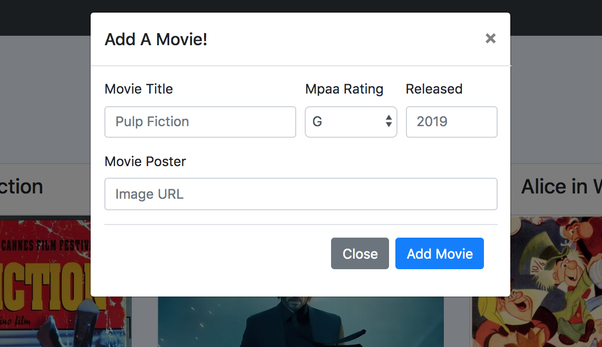
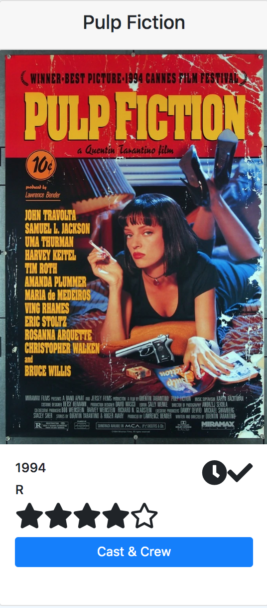
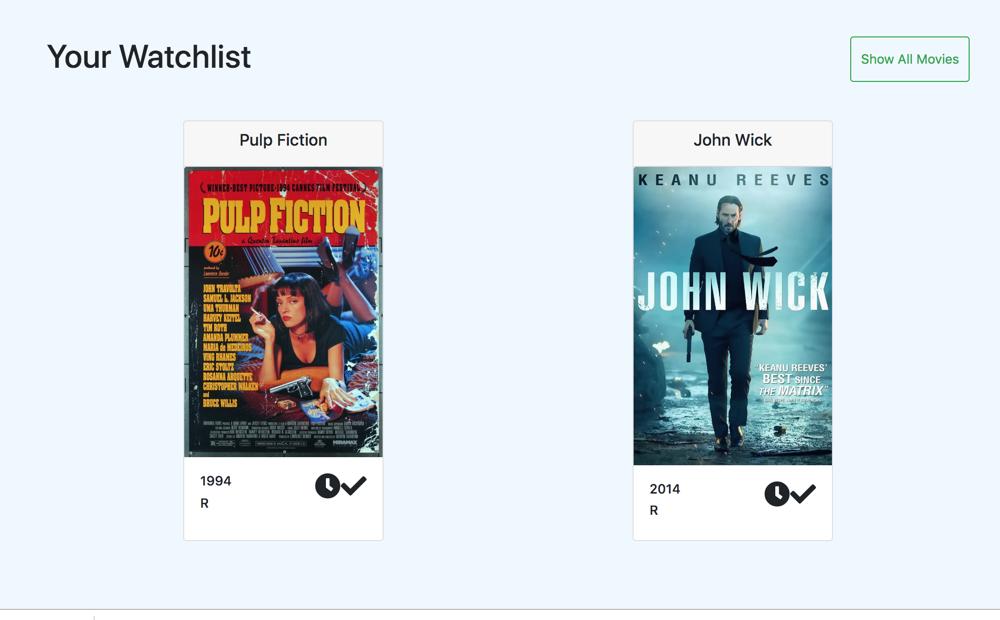
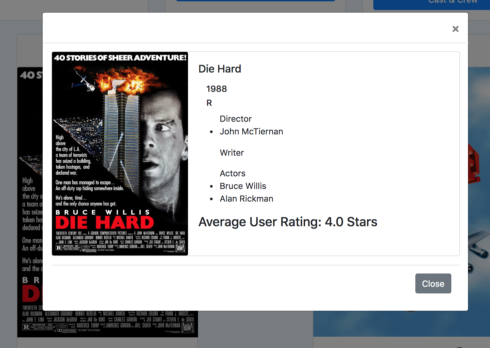

# Movie History

## Description
This is a fun little website that a user can add a movie to a database, rate movies they have watched and add or remove a movie from their database. Clicking the cast and crew button shows more detailed info about the movie.

## Screenshots
* Landing Page

* Add A Movie

* Reviewed and on the watchlist

* Unreviewed and not on watchlist

* Watchlist Page

* Cast and Crew

## Installation Instructions
* Clone down this repo
* At the root of the project, run `npm install`

## How to run
* In the terminal, type `npm start` to run the webpage.
* If you want to make a production build of this project, type `npm run build`. This will create a folder called build with all of the minified code you need.

## Author
Greg Stephen